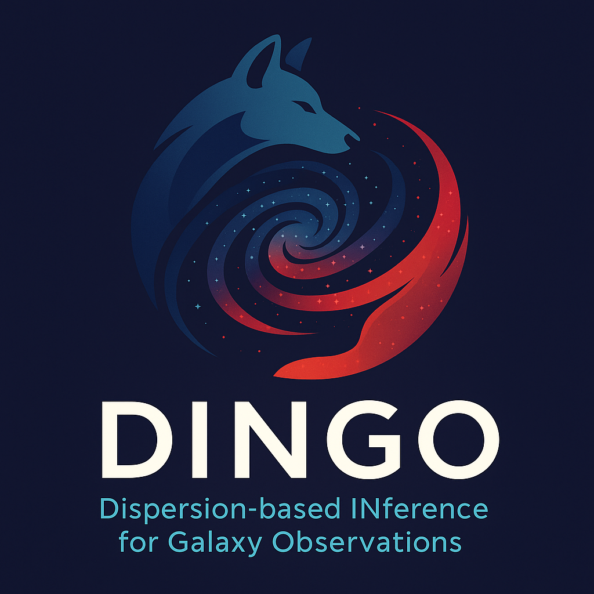

<p align="center">
  
</p>

# DINGO

**DINGO** — *Dispersion-based INference for Galaxy Observations* — is a Python package designed to fit galaxy kinematics using **both R and C grism spectroscopy**.

It provides robust modeling of galaxy rotation curves, dynamical mass profiles, and kinematic fields through a joint-inference framework leveraging dual-grism data (R+C) from instruments like JWST/NIRCam.

---

## Features (under development)

- 🔵 Joint modeling of R and C grism images.
- 🔵 Arctangent disk rotation curve fitting.
- 🔵 Velocity field generation.
- 🔵 Dynamical mass profile estimation.
- 🔵 Visualization tools for grism images, velocity fields, and residuals.

---

## Installation

For active development:

```bash
git clone git@github.com:Chisen-Lupus/grism-kinematics.git
cd grism-kinematics
pip install -e .
```

---

## Calibration Files

DINGO requires access to **grism calibration files** for dispersion and tracing models.  
These files are not bundled directly inside the package.

By default, DINGO looks for calibration files in:

```bash
/data/grism_cal/
```

You can **override** this location by setting an environment variable before running:

```bash
export GRISM_CAL_DIR=/path/to/your/grism_cal
```

If the environment variable `GRISM_CAL_DIR` is set, DINGO will use that path instead.

For **MAGNIF** users, make sure that `/data/grism_cal/` is available and contains the required calibration datasets.
